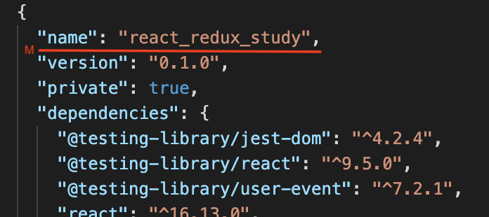

## code ENOSELF 애러 발생
npm에서 npm-redux를 설치하던 중 'code ENOSELF' 애러가 발생하였다.

"react-redux"라는 패키지 하위에 "react-redux"패키지 설치를 거부한다는 내용...

프로젝트 이름과 설치파일명이 같아서 생긴 애러이다. 

이 경우 폴더 이름만 변경하면 안된다. 다시 설치를 진행해도 똑같은 애러가 뜰 것이다.
package.json과 package-lock.json 파일을 열어 name을 변경해주어야 한다.

이렇게 name을 변경해주고 다시 설치를 진행하면 성공적으로 설치가 된다.

